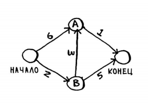
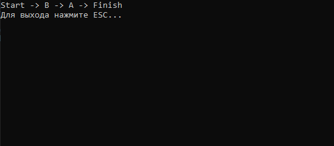

# Алгоритм Дейкстры

Данная задача - пример применения алгоритма Дейкстры из книги ***"Грокаем алгоритмы"***.

Имеется граф:

Вес каждой связи между вершинами обозначает время пути. Необходимо воспользоваться алгоритмом Дейкстры и найти самый оптимальный путь.

В код из книги был добавлен вывод пути на консоль:

