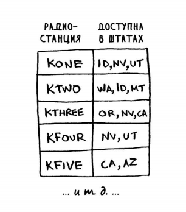
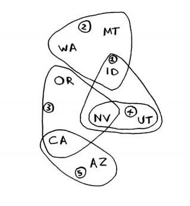
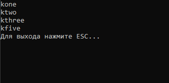

# Задача о покрытии множества

Данная задача - реализация задачи о покрытии множества из книги ***"Грокаем алгоритмы"***

Имеется определенное количество штатов, формирующие множество и радиостанции, каждая из которых покрывает некоторое число штатов:

Радиостанции формируют следующую картину:

Требуется найти **минимальное** число станций, чтобы они покрывали **все** штаты.

При реализации данной задачи был использован **жадный алгоритм**.

Результат работы программы:

Данный результат *не является* единственным верным решением. Например, результат **ktwo, kthree, kfour, kfive** тоже правильный.

Принцип работы данного жадного алгоритма заключается в том, чтобы на каждой итерации цикла найти самую подходящую станцию (с самым большим покрытием), что является *локально-оптимальным* решением. В результате получаем  *глобально-оптимальное* решение.

Сложность алгоритма - О(n^2).